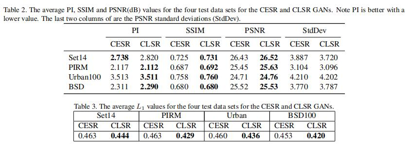

<!-- Add banner here -->

# LSRGAN

### Optimizing Generative Adversarial Networks for Image Super Resolution via Latent Space Optimization

We explicitly apply the Lipschitz Continuity Condition (LCC) to optimize and regularize the GAN. 
An encoding network that maps the image space to a new optimal latent
space is derived from the LCC, and it is used to augment
the GAN architecture as a coupling component.

# Installation
- Python 3
- torch==1.4.0
- torchvision==0.5.0
- opencv_python==4.5.1.48
- numpy==1.19.2
- lmdb==1.1.1
- scikit_image==0.17.2

# Test models With Ground Truth
with ground truth, psnr, ssim will be calculated

1. Clone github repo.

```
git clone https://github.com/aicvsearch/LSRGAN.git
cd LSRGAN

```
2. Download pretrained models and testing datasets from [Google Drive](https://drive.google.com/file/d/1GRS0_D9b0rm6Cisc8RRSZY7k3ESi0BdE/view?usp=sharing). Place the models in ./pre_train_models and
the testing datasets in ./test_datasets. We provide four models: LSR, CLSR, CESR and ESR. ESR is downloaded from  https://github.com/xinntao/ESRGAN.
We also provide Set14, PIRM, Urban100, and BSD100.

3. Run test.
```
cd codes
sh run_test.sh

```

4. The results are save in ./Results folder.

# Test models Without Ground Truth
without ground truth, only SR image will be generated

1. open ./test/*.json file
2. set dataset mode as "LR" and set image fold path to dataroot_LR
```
for example
 "test_1": {
      "name": "dataset's name"
      ,"mode": "LR"
      ,"dataroot_LR": "dataset path"
    }

```
3. run run_test.sh
```
cd codes
sh run_test.sh

```
4. The results are save in ./Results folder.


## Quantitative Results
<p align="center">
  
</p>
<p align="center">
  
</p>

## Qualitative  Results

<p align="center">
  
</p>


